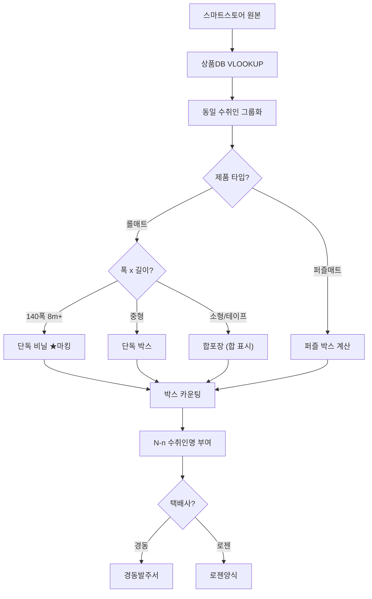

# 패킹 알고리즘 개괄

> 따사룸 발주 시스템의 포장 방식 결정 알고리즘
> **최종 수정일**: 2025.12.16 (발주담당자 실제 데이터 반영)

---

## 1. 포장 방식 개요

발주 시스템에서는 주문 상품의 특성에 따라 **3가지 포장 방식**을 자동으로 결정합니다.

| 포장 방식 | 설명 | 적용 조건 |
|-----------|------|-----------|
| **박스포장** | 기본 포장 방식 | 롤매트 5m 이하, 합포장 물품 |
| **비닐포장** | 대형 롤 전용 | 롤매트 8m 이상 (140폭 기준) |
| **합포장** | 여러 롤을 하나의 박스에 | 소형 상품, 테이프 등 |

---

## 2. 포장 방식 결정 알고리즘

> **📌 정보 출처**: 발주담당자(조은란D) 실제 작업 데이터 (2025.12.16)

### 2.1 결정 순서

```
1단계: 제품 타입 확인
   ↓
   퍼즐매트? → YES → 비닐포장 (퍼즐 전용)
   ↓ NO
2단계: 롤매트 길이 확인
   ↓
   140폭 8m 이상? → YES → 비닐포장 + ★마킹
   ↓ NO
3단계: 소형 상품 확인
   ↓
   소형/테이프? → YES → 합포장 (합 표시)
   ↓ NO
4단계: 기본값
   ↓
   박스포장
```

### 2.2 비닐포장 조건 (실제 데이터 기준)

| 조건 | 포장 방식 | 마킹 |
|------|----------|------|
| 롤매트 140폭 8m 이상 | 비닐 | 이름★ |
| 퍼즐매트 6개 이상 | 비닐 | - |

> **⚠️ 이전 기획 vs 실제 차이**
> - 기획: 길이값 합계 ≥ 100cm → 비닐
> - 실제: **롤 단위** 8m 이상 → 비닐

---

## 3. 합포장 알고리즘

### 3.1 합포장 조건

1. **동일 수취인**: 이름, 주소, 연락처 모두 일치
2. **동일 제품군**: 롤매트↔롤매트 O / 퍼즐↔퍼즐 O / **롤↔퍼즐 X**
3. **소형 상품**: 테이프, 짧은 롤 등

### 3.2 합포장 처리

- `합` 표시를 비고에 추가
- 다른 박스에 함께 포장됨을 의미
- 별도 송장 발급 안함

### 3.3 폭 우선순위

큰 폭의 박스가 작은 폭을 포함할 수 있음:
```
140cm > 120cm > 110cm
```

---

## 4. 박스 분리 및 라벨링

### 4.1 N-n 수취인명 형식

동일인에게 여러 박스로 나눠 보내는 경우:
```
N-n 수취인명
```
- **N**: 총 박스 수
- **n**: 해당 라인의 순번

예시:
```
4-1나대남★ : (110)17T마블아이보리 5.5m  ← 1번 박스
4-2나대남  : (110)17T마블아이보리 5m    ← 2번 박스
4-3나대남  : 테이프 + 롤 합포장          ← 3번 박스
4-4나대남  : (120)17T 3m + 2m 합포장    ← 4번 박스
```

### 4.2 마킹 규칙

| 마킹 | 위치 | 의미 |
|------|------|-----|
| `★` | 이름 뒤 | 파손주의 (대형 롤) |
| `N-n` | 이름 앞 | N박스 중 n번째 |
| `합` | 비고 | 다른 박스에 합포장 |

---

## 5. 두께별 포장 기준

> **⚠️ 확인 필요**: 정확한 임계값은 추가 데이터 분석 필요

### 5.1 실제 사용되는 두께

| 제품군 | 두께 |
|--------|------|
| 유아 롤매트 | 12T, 17T, 22T |
| 애견 롤매트 | 6T, 9T, 12T |
| 퍼즐매트 | 25T, 40T |

> **⚠️ 기획문서 vs 실제 차이**
> - 기획: 14T, 18T, 23T 포함
> - 실제: **15T, 17T** 사용 (제품DB 기준)

### 5.2 포장 기준 (추정)

| 두께 | 소박스 | 대박스 | 비닐 |
|------|--------|--------|------|
| 6T | ~8m | ~12m | 12.5m+ |
| 9T | ~6m | ~10m | 10.5m+ |
| 12T | ~3.5m | ~8m | 8.5m+ |
| 17T | ~3m | ~7m | **8m+** (실제 데이터) |
| 22T | ~1m | ~3m | 3.5m+ |

---

## 6. 택배사별 분기

### 6.1 경동택배 (대형화물)
- 포장상태, 가로/세로/높이 정보 필요
- `송장화1` 시트 사용
- 최종: `경동발주서` 양식

### 6.2 로젠택배 (일반택배)
- 디자인+배송메세지 중심
- `송장화2` 시트 사용
- 최종: `로젠` 양식

---

## 7. 전체 플로우차트



---

## 8. 관련 문서

- [조은란D 제공자료 분석](../조은란%20D%20제공자료에%20대한%20주석.md) - 실제 데이터 분석
- [따사룸 제품 정보](./따사룸%20제품%20정보%20및%20스펙.md) - 제품 스펙
- [추가 확인사항](./추가_확인사항.md) - 개발 명세서
