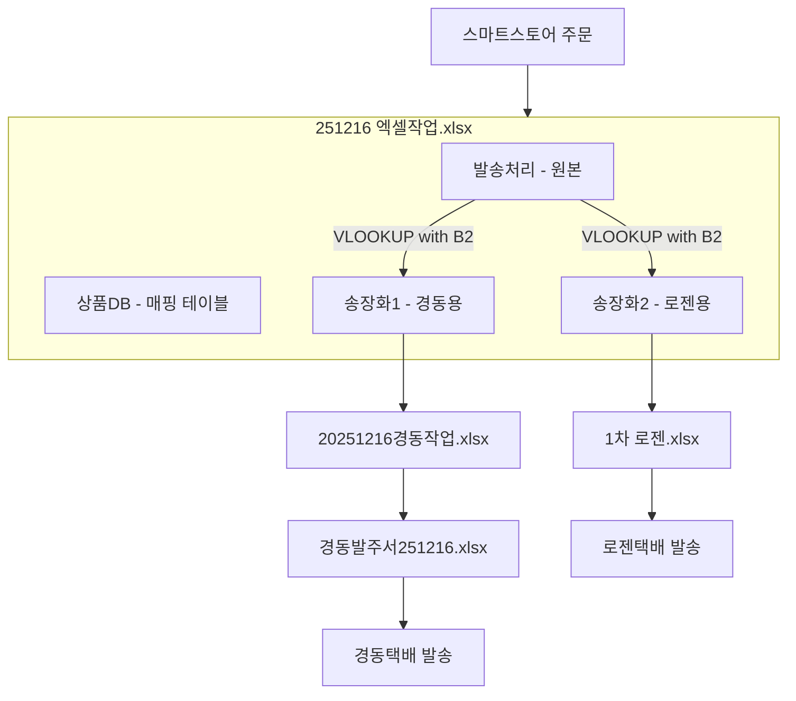
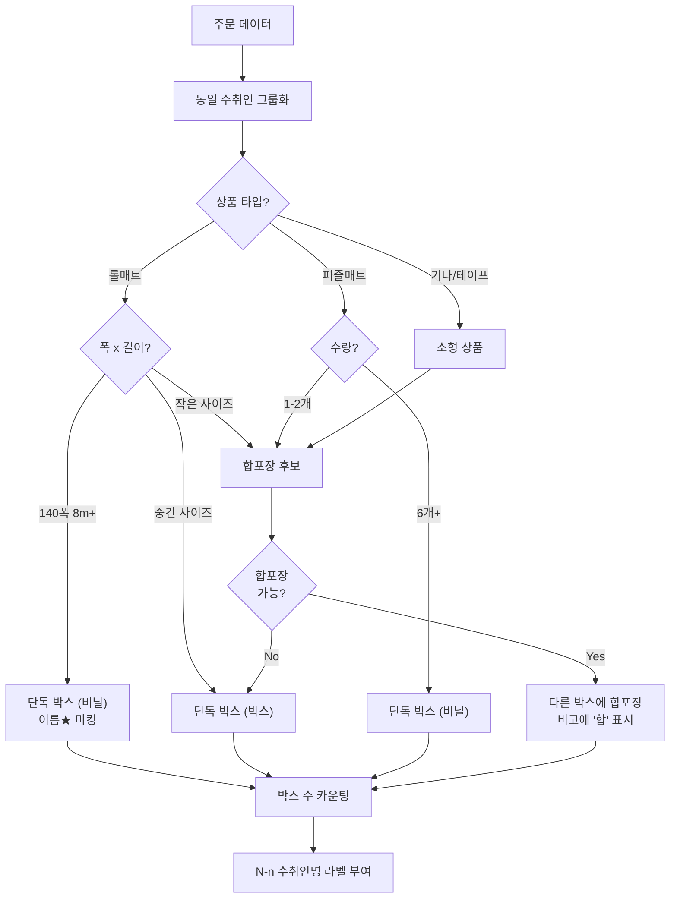
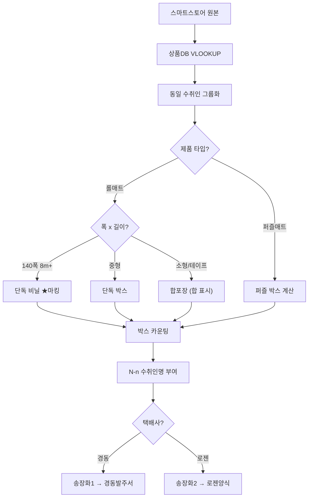

# 조은란D 제공자료 2025.12.16 분석

## 파일 구조 개요

```
조은란D 제공자료 2025.12.16/
├── 251216 엑셀작업.xlsx      ← 마스터 데이터 (원본)
├── 20251216경동작업.xlsx     ← 경동택배 발주 작업 파일
├── 경동발주서251216(1).xlsx  ← 경동택배 최종 발주서
└── 1차 로젠.xlsx             ← 로젠택배 발주서
```

---

## 1. 251216 엑셀작업.xlsx (마스터 데이터)

| Sheet         | 용도                | 주요 컬럼                                                |
| ------------- | ----------------- | ---------------------------------------------------- |
| **발송처리**      | 스마트스토어 원본 주문 데이터  | 상품주문번호, 주문번호, 수취인명, 주문상태, 배송방법, 택배사...               |
| **송장화1**      | 경동택배용 변환 데이터      | 상품주문번호, 수취인명, 운임타입, 송장수량, 디자인, 길이, 수량, 추가상품1...      |
| **송장화2**      | 로젠택배용 변환 데이터 (추정) | 상품주문번호, 수취인명, 운임타입, 송장수량, 디자인, 길이, 수량, **디자인+수량**... |
| **상품DB(수정x)** | 상품번호→디자인/길이 매핑 DB | 상품번호, 최종옵션명, 디자인, 길이                                 |

### 핵심 포인트
- `발송처리` → 원본 주문 데이터
- `상품DB`를 통해 상품번호로 디자인/길이를 VLOOKUP하여 `송장화1`, `송장화2` 생성
- **송장화1 vs 송장화2 차이**: 송장화2에 `디자인+수량` 컬럼 존재 (병합 컬럼)

---

## 2. 20251216경동작업.xlsx (경동택배 작업)

| Sheet         | 용도             | 설명                         |
| ------------- | -------------- | -------------------------- |
| **경동전체1**     | 경동 전체 주문 목록    | `251216 엑셀작업/송장화1`과 유사한 구조 |
| **경동발주서 양식2** | 경동 발주서 양식 (중간) | 경동택배 시스템 업로드용 포맷           |
| **경동샘플 양식3**  | 경동 발주서 양식 (최종) | 업로드 직전 최종 검토용              |

### 데이터 흐름
```
송장화1 → 경동전체1 → 경동발주서 양식2 → 경동샘플 양식3
```

---

## 3. 경동발주서251216(1).xlsx (최종 발주서)

- **Sheet1**: 경동택배에 실제 제출할 최종 발주서
- 컬럼: 받는분, 주소, 상세주소, 운송장번호, 고객사주문번호, 우편번호, 도착영업소, 전화번호, 품목명, 수량, 포장상태, 가로, 세로...
- `20251216경동작업.xlsx/경동발주서 양식2`와 동일 구조

---

## 4. 1차 로젠.xlsx (로젠택배 발주서)

| Sheet | 설명 |
|-------|------|
| **로젠** | 로젠택배 발주 1차 |
| **로젠2** | 로젠택배 발주 2차 |
| **로젠3** | 로젠택배 발주 3차 |

- 공통 컬럼: 받는분, 받는분 전화번호, 받는분 핸드폰, 우편번호, 받는분 주소, 운임타입, 송장수량, 디자인, 배송메세지, 합배송여부
- `251216 엑셀작업/송장화2`에서 변환된 것으로 추정

---

## 전체 데이터 플로우



---

## 알게된 사실

### 수취인명 형식
동일인에게 여러 박스로 나눠 보내는 경우:
```
N-n 수취인명
```
- **N**: 총 박스 수 (분모)
- **n**: 해당 라인의 순번 (분자)

예: `2-1 홍길동`, `2-2 홍길동` → 홍길동에게 총 2박스, 이 라인은 1번째/2번째 박스

### 택배사별 분기
- **경동택배**: 대형 화물, 포장상태/가로/세로/높이 정보 필요
- **로젠택배**: 일반 택배, 디자인+배송메세지 중심

### 송장화1 vs 송장화2
- 송장화1: 추가상품1 컬럼 존재 (경동용)
- 송장화2: 디자인+수량 병합 컬럼 (로젠용)

---

## 패킹 알고리즘 추론

### 1. 박스 분리 기준 (수취인명 N-n 부여)

동일 수취인의 주문이 여러 라인일 때 박스를 나누는 기준:

| 조건 | 박스 분리 |
|------|---------|
| **롤 매트 폭(cm) x 길이(m)** | 특정 임계값 초과 시 분리 (예: 140폭 8m = 1박스) |
| **퍼즐매트 수량** | 6개 이상일 경우 1박스로 묶음 |
| **합포장 가능 여부** | 작은 상품은 `합` 표시로 다른 박스에 합포장 |

#### 실제 예시 - 나대남 (4박스)
```
4-1나대남★ : (110)17T마블아이보리 5.5m x1  ← 단독 1박스 (파손주의★)
4-2나대남  : (110)17T마블아이보리 5m x1    ← 단독 1박스
4-3나대남  : (110)17T마블아이보리 5m x1 + 테이프 ← 합포장
4-4나대남  : (120)17T마블아이보리 3m + 2m  ← 작은 것끼리 합포장
```

### 2. 포장상태 결정 로직

| 포장상태 | 조건 (추정) |
|---------|-----------|
| **비닐** | 롤매트 8m 이상 (큰 단일 롤) |
| **박스** | 롤매트 5m 이하, 퍼즐매트, 합포장 물품 |

#### 실제 예시
```
이주현★   : (140)17T퓨어아이보리 8m   → 비닐
전준하★   : (140)17T퓨어아이보리 8m   → 비닐
4-2나대남  : (110)17T마블아이보리 5m  → 박스
류춘렬    : (110)17T퓨어아이보리 5m   → 박스
한정우    : 플러스♥25T아이(100) 퍼즐 → 비닐
```

### 3. 수취인명 마킹 규칙

| 마킹 | 의미 |
|------|-----|
| `★` (이름 뒤) | 파손주의 필요 - 대형 롤매트 |
| `N-n` (이름 앞) | N개 박스 중 n번째 |
| `합` (비고) | 해당 라인은 다른 박스에 합포장됨 |

### 4. 추론된 패킹 플로우차트



### 5. 해결되지 않은 질문

- [ ] 폭(cm) x 길이(m)의 정확한 박스 분리 임계값?
- [ ] 퍼즐매트 몇 개까지 1박스에 담기는가?
- [ ] 합포장 시 최대 몇 개 상품까지 한 박스에?
- [ ] 비닐/박스 결정의 정확한 기준 (무게? 부피?)

---

## 기획문서 vs 실제 데이터 비교 분석

> 참고: `발주 프로그램기획/` 폴더 내 기획문서와 발주담당자(조은란D) 실제 데이터 비교
> **충돌 시 발주담당자 실제 데이터 우선 적용**

### 🔴 충돌 발견

| 항목 | 기획문서 | 발주담당자 실제 데이터 | 우선적용 |
|------|---------|---------------------|---------|
| **비닐포장 조건** | 길이값 합계 ≥ 100cm | 대형 롤 8m 이상 | ✅ 발주담당자 |
| **박스 분리 단위** | 두께별 길이 합산 후 판단 | 주문라인 단위로 분리 (N-n 마킹) | ✅ 발주담당자 |
| **두께 종류** | 6T, 9T, 12T, 14T, 18T, 23T | 6T, 9T, 12T, **15T, 17T** | ✅ 발주담당자 |

### 🟢 일치하는 부분

| 항목 | 내용 |
|------|-----|
| 롤매트 ↔ 퍼즐매트 | 절대 합포장 안함 |
| 합포장 조건 | 동일 수취인 (이름+주소+연락처) |
| 폭 우선순위 | 140 > 120 > 110 |
| 재단요청 감지 | 배송메세지 키워드 확인 |

### 🟡 추가 파악 사항 (발주담당자 자료)

| 항목 | 내용 |
|------|-----|
| `★` 마킹 | 파손주의 필요 (대형 롤) |
| `합` 비고 | 해당 라인은 다른 박스에 합포장 |
| `N-n` 수취인명 | N박스 중 n번째 |
| 운임타입 | 금액 직접 기재 (예: 12100, 19400) |

---

## 통합 알고리즘 (최종)

